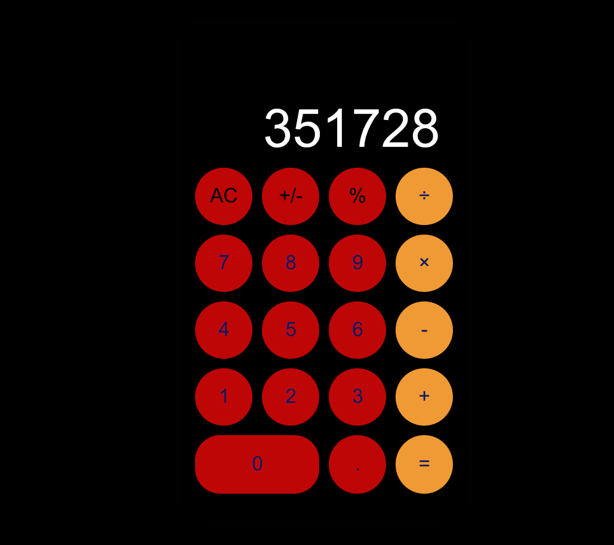

Here's the equivalent README adapted for your **Simple Calculator** project built with **HTML, CSS, and JavaScript** while keeping the same professional structure and style.

# 🧮 Simple Calculator

> A responsive web-based calculator built with HTML, CSS, and JavaScript that performs basic arithmetic operations through a clean, modern, and user-friendly interface.

---

## 📌 Problem Statement

Many beginner web developers need hands-on experience implementing JavaScript logic and creating interactive user interfaces. This project demonstrates how a functional calculator can be built using only HTML, CSS, and JavaScript while maintaining responsiveness, usability, and clean code practices.

---

## 🎯 Project Goals

* Build a responsive calculator interface
* Practice HTML structure and semantic markup
* Improve CSS styling and responsive layouts
* Implement calculator logic using JavaScript
* Strengthen DOM manipulation and event-handling skills

---

## 🛠 Tech Stack

**Frontend:**

* HTML5
* CSS3
* JavaScript (ES6)

**Other Tools:**

* Git & GitHub
* VS Code

---

## 🖥 Features

* Responsive calculator layout
* Addition, subtraction, multiplication, and division operations
* Decimal number support
* Clear (C) button to reset calculations
* Interactive button clicks
* Clean and modern user interface
* Mobile-friendly design

---

## 📸 Screenshot



---

## ⚙ Installation & Setup

### 📥 Clone the repository

```bash
git clone git@github.com:Hache-premier/Simple-Calculator.git
cd Simple-Calculator
```

---

### ▶ Run the project

You can open it in your browser in two ways:

**Option 1: Direct Open**

* Open the `index.html` file in your preferred web browser.

**Option 2 (Recommended): Live Server**

* Install the **Live Server** extension in VS Code.
* Right-click `index.html`.
* Select **Open with Live Server**.

---

## 🧠 Challenges Faced

* Implementing calculator logic correctly
* Handling consecutive arithmetic operations
* Managing user input and display updates
* Creating a responsive layout across different screen sizes
* Ensuring a smooth and intuitive user experience

---

## 📚 What I Learned

* Building interactive web applications with JavaScript
* Manipulating the DOM using event listeners
* Implementing arithmetic operations programmatically
* Writing cleaner, reusable JavaScript code
* Designing responsive interfaces with HTML and CSS

---

## 🚀 Future Improvements

* Add keyboard input support
* Include percentage (%) and square root (√) operations
* Add scientific calculator functions
* Implement calculation history
* Add dark/light mode toggle
* Improve animations and button interactions

---

## 👨🏽‍💻 Author

**Ndonwi Ashley Cheo**
Software Engineering Student

🌍 Based in Cameroon | Passionate about web development and continuously learning new technologies 🚀
